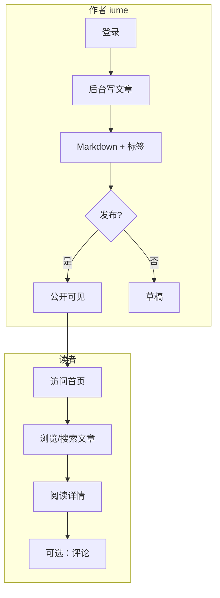

# iume-atelier 产品设计文档（PRD）

> 最后更新：2026-06-06 | 当前进度：**45%** | 版本目标：**v1.0.0**
>
> 关联：[技术规划](./iume-atelier-ai-code-plan.md) · [设计系统](./design-system/MASTER.md) · [发版记录](./RELEASE.md)

---

## 1. 产品概述

**一句话**：iume 的个人写作工作室 — 优雅地写作、发布与分享。

**愿景**：打造一个属于 iume 的线上文字空间，兼顾阅读美感与写作效率，可持续迭代为多人协作内容平台。

**项目类型**：博客 / 内容站 | **规模**：中型

**技术栈**：React + Spring Boot + MySQL | **仓库**：follower-ding/iume-atelier

---

## 2. 目标用户

| Persona | 描述 | 核心诉求 |
|---------|------|----------|
| **iume（作者）** | 项目主人，主要写作与管理者 | 高效写 Markdown、管理文章、看数据 |
| **读者** | 访问公开页面的访客 | 舒适阅读、搜索、订阅更新 |

---

## 3. 功能清单与进度

### P0 — v1.0 必须

| 状态 | 功能 | 说明 | 页面/模块 |
|------|------|------|-----------|
| [x] | 用户登录 | JWT，admin 默认账号 | `/login` |
| [x] | 文章 CRUD | Markdown 编写、草稿/发布 | `/admin` |
| [x] | 文章列表与详情 | 公开阅读 | `/` `/articles/:slug` |
| [x] | 标签分类 | 文章打标签 | 后台 + 前台展示 |
| [x] | 健康检查 | CD 部署探活 | `/api/health` |
| [x] | GitHub CD | push main 自动部署 | deploy/ |
| [~] | 评论 | 登录用户评论 | 文章详情页 |
| [~] | 搜索 | 标题/正文搜索 | 首页 |
| [~] | RSS | 订阅源 | `/api/rss` |

### P1 — v1.0 应有

| 状态 | 功能 | 说明 |
|------|------|------|
| [ ] | SEO 优化 | sitemap、meta、JSON-LD |
| [ ] | 多用户/权限 | 作者/管理员角色 |
| [ ] | Markdown 实时预览 | 后台编辑器增强 |
| [ ] | E2E 测试 | Playwright 冒烟 |
| [ ] | API 类型同步 | sync-api-types.ps1 |

### P2 — 后续版本（v1.1+）

| 版本 | 功能 | 说明 |
|------|------|------|
| v1.1 | 媒体库 | 图片上传与管理 |
| v1.1 | Newsletter | 邮件订阅 |
| v1.2 | 全文搜索 | Elasticsearch |
| v2.0 | 多作者协作 | 见 ai-code-plan Phase 2 |

---

## 4. 页面清单

| 页面 | 路由 | 权限 | 状态 | 设计参考 |
|------|------|------|------|----------|
| 首页（文章列表） | `/` | 公开 | [x] | MASTER.md |
| 文章详情 | `/articles/:slug` | 公开 | [x] | MASTER.md |
| 登录 | `/login` | 公开 | [x] | MASTER.md |
| 后台管理 | `/admin` | 登录 | [x] | MASTER.md |
| 搜索页 | `/search` | 公开 | [ ] | 待设计 |
| RSS 入口 | footer 链接 | 公开 | [ ] | — |

---

## 5. 核心用户流程

---

## 6. 里程碑

| 里程碑 | 目标 | 交付标准 | 状态 |
|--------|------|----------|------|
| v1.0.0 MVP | 2026-06 | P0 全部 [x]，可上线 | [~] |
| v1.0.1 | 2026-06 | SEO + E2E + 评论完善 | [ ] |
| v1.1.0 | 2026-Q3 | 多用户 + 媒体库 | [ ] |

---

## 7. 进度总览

| 类别 | 完成 | 总计 | 进度 |
|------|------|------|------|
| P0 功能 | 6 | 9 | 67% |
| P1 功能 | 0 | 5 | 0% |
| 页面 | 4 | 6 | 67% |
| **综合（P0×70%+P1×30%）** | — | — | **45%** |

---

## 8. 非功能需求

- [x] 响应式布局基础
- [ ] 首屏加载 < 3s（待测）
- [x] `/api/health`
- [ ] SEO 完整（sitemap/meta）
- [x] Docker + GitHub CD
- [ ] E2E 自动化测试

---

## 9. 变更记录

| 日期 | 变更 | 作者 |
|------|------|------|
| 2026-06-06 | 初稿：基于创建对话整理，脚手架 v1.0 已完成 | AI |
| 2026-06-06 | 新增 PRD 文档体系，纳入 project-prd skill | AI |

---

## 10. 下一步行动

1. **完善 P0**：评论 UI、搜索页、RSS 前端入口
2. **跑通部署**：服务器填 `.env` + GitHub Secrets，首次 `docker compose up`
3. **P1 启动**：seo-blog skill → sitemap + PageMeta
4. **同步 PRD**：每完成一项，把上表 `[ ]` 改为 `[x]`
