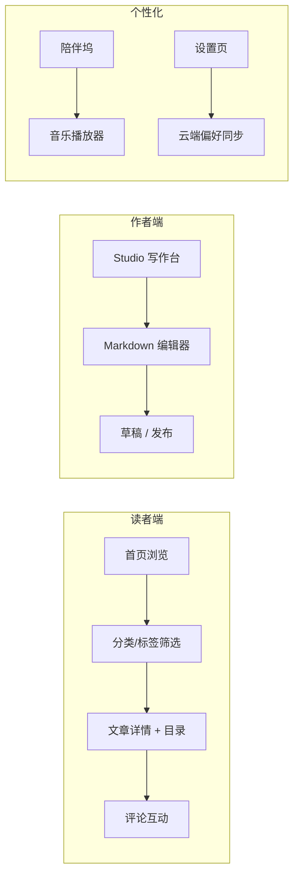

# 从 0 到 1：iume-atelier 产品设计与搭建思路

> 本文是 **iume-atelier 系列** 的第一篇，从产品视角讲清楚：这个项目是什么、为谁做、功能怎么拆、以及从想法到上线的整体路径。


## 一、项目定位：不只是博客，是「写作工作室」

很多技术博客只解决「发文章」这一件事。iume-atelier 的定位更高一层：

- **读者**：获得 Josh Comeau 风格的沉浸式阅读体验（目录导航、进度条、精选排版）
- **作者**：在 Studio 写作台里用 Markdown 创作、草稿/发布分离、封面与图片上传
- **管理员**：在 Console 后台管理用户、评论、分类标签与审计日志

一句话总结：**这是一个「能写、能读、能运营」的个人技术博客平台**。

## 二、核心功能地图



### 2.1 内容体系：大类 vs 标签

这是产品设计上很重要的一个决策：

| 维度 | 含义 | 示例 |
|------|------|------|
| **大类（Category）** | 内容方向 | 编程、AI、生活 |
| **标签（Tag）** | 具体技术关键词 | Java、React、Spring Boot |

大类帮助读者「选方向」，标签帮助「找细节」。首页文案也明确区分了两者，避免用户困惑。

### 2.2 三条用户路径

**路径 A — 访客阅读**

1. 进入首页，浏览分类胶囊（编程 / AI / 生活）
2. 点击文章卡片进入详情页
3. 右侧目录跟随滚动高亮，顶部进度条显示阅读进度
4. 可选：登录后发表评论

**路径 B — 作者写作**

1. 注册/登录 → 进入 `/studio`
2. 新建文章，在 Markdown 编辑器中写作（支持预览、分屏）
3. 上传封面图、选择大类和标签
4. 「保存草稿」或「发布」—— 发布即对公众可见

**路径 C — 管理员运营**

1. 以 ADMIN 角色登录 → 进入 `/console`
2. 管理全部文章、用户、评论
3. 在「分类标签」面板维护 taxonomy
4. 查看审计日志

## 三、产品亮点功能

### 3.1 陪伴坞（Companion Dock）

博客右下角有一个可拖动的「陪伴坞」：

- 显示用户头像（或默认形象）
- 单击弹出鼓励语，阅读文章时自动切换为「阅读模式」
- 内置音乐播放器，支持雨声、白噪音等环境音
- **写作台和设置页自动隐藏**，避免遮挡编辑区域

### 3.2 设置页五分区

登录后在 `/settings` 可以管理：

1. **资料** — 昵称、邮箱、头像
2. **陪伴个性** — 称呼、自定义鼓励语（最多 8 条）
3. **歌单** — 上传音频、编辑曲目信息
4. **外观** — 深色/浅色、音效、简洁模式
5. **安全** — 修改密码

所有个性化数据支持 **云端同步**，换设备登录后自动恢复。

### 3.3 阅读体验

参考 [Josh W. Comeau](https://www.joshwcomeau.com/) 的博客排版：

- 文章正文窄栏居中，两侧留白
- 桌面端右侧 sticky 目录，滚动时当前章节高亮
- 手机端目录变为顶部横向 chips
- 顶部阅读进度条

## 四、从 0 到 1 的搭建节奏

| 阶段 | 目标 | 产出 |
|------|------|------|
| **P0 基础** | 能发能读 | 用户注册登录、文章 CRUD、Markdown 渲染 |
| **P1 体验** | 像样儿的博客 | 分类标签、搜索、RSS、SEO meta |
| **P2 差异化** | 有记忆点 | 陪伴坞、音乐、设置页、云端同步 |
| **P3 运营** | 能管能用 | Console 后台、评论审核、审计日志 |
| **P4 部署** | 推送即发布 | Docker + GitHub Actions CD |

实际开发中，我们采用 **前后端分离 + Flyway 数据库迁移** 的方式，保证每次功能迭代都有可追溯的 schema 变更。

## 五、技术栈概览（产品同学也看得懂）

| 层 | 选型 | 为什么 |
|----|------|--------|
| 前端 | React 19 + Vite + Tailwind | 组件化、热更新快、样式灵活 |
| 后端 | Spring Boot 3 + MyBatis-Plus | Java 生态成熟、API 开发效率高 |
| 数据库 | MySQL 8 | 关系型数据、JSON 字段存偏好 |
| 部署 | Docker Compose + GHCR | 一键部署、镜像版本可控 |

详细技术实现请看本系列 **技术篇**。

## 六、本地快速体验

```bash
# 后端（端口 8080，context-path /api）
cd iume-atelier-backend && mvn spring-boot:run

# 前端（端口 5173）
cd iume-atelier-frontend && npm run dev
```

默认管理员：`admin` / `admin123`

## 七、系列文章导航

| 篇目 | 视角 | 主题 |
|------|------|------|
| **本篇** | 产品 | 整体设计与搭建思路 |
| 下一篇 | 产品 | 阅读体验：目录导航与陪伴坞 |
| 第三篇 | 技术 | 全栈架构选型 |
| 第四篇 | 技术 | 用户偏好云端同步 |
| 第五篇 | 踩坑 | Flyway 迁移与分类重构 |

---

*iume-atelier — 用代码与文字，记录思考。*
