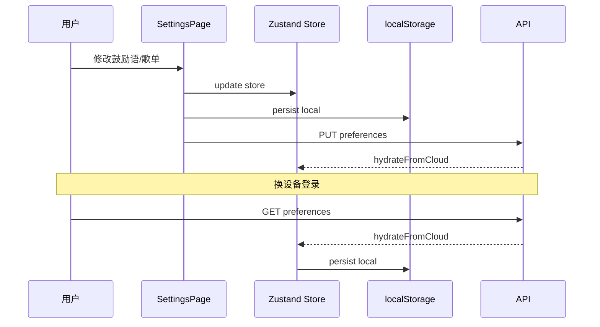

# 用户偏好云端同步与 JWT 鉴权实践

> 本篇深入 **iume-atelier 技术系列** 的两个横切关注点：JWT 无状态鉴权，以及陪伴坞/歌单等个性化数据的云端同步。

## 一、为什么需要云端同步

陪伴坞的鼓励语、自定义歌单存在 `localStorage` 里—— 换浏览器或换设备就丢了。

产品需求：**登录用户的个性化设置应该跟着账号走**。

## 二、数据模型设计

### 2.1 数据库层（Flyway V4）

```sql
ALTER TABLE users
    ADD COLUMN preferences JSON NULL
    COMMENT 'User personalization: companion quotes, music playlist'
    AFTER avatar;
```

选择 JSON 字段而非拆表，因为：

- 偏好结构可能频繁迭代（加字段不改 schema）
- 读写总是「整个偏好对象」，不需要 JOIN
- MySQL 8 原生支持 JSON 类型

### 2.2 偏好数据结构

```typescript
interface UserPreferences {
  companionCallName: string      // 陪伴坞称呼，如 "小明"
  customQuotes: string[]         // 自定义鼓励语，最多 8 条
  customTracks: CustomMusicTrack[] // 自定义歌单，最多 30 首
}

interface CustomMusicTrack {
  id: string
  title: string
  artist: string
  url: string   // /api/uploads/xxx.mp3
}
```

### 2.3 后端 DTO

```java
public class UserPreferencesRequest {
    @Size(max = 20)
    private String companionCallName;
    @Size(max = 8)
    private List<@NotBlank @Size(max = 100) String> customQuotes;
    @Size(max = 30)
    private List<CustomMusicTrackRequest> customTracks;
}
```

后端 `UserService.updatePreferences()` 做校验后写入 JSON 字段。

## 三、API 设计

| 方法 | 路径 | 说明 |
|------|------|------|
| GET | `/api/users/me/preferences` | 拉取当前用户偏好 |
| PUT | `/api/users/me/preferences` | 更新偏好（全量覆盖） |

Controller 片段：

```java
@GetMapping("/me/preferences")
public Result<UserPreferencesResponse> getPreferences() {
    return Result.ok(userService.getPreferences(SecurityUtils.getCurrentUserId()));
}

@PutMapping("/me/preferences")
public Result<UserPreferencesResponse> updatePreferences(
        @Valid @RequestBody UserPreferencesRequest request) {
    return Result.ok(userService.updatePreferences(
        SecurityUtils.getCurrentUserId(), request));
}
```

## 四、前端同步流程

### 4.1 架构图



### 4.2 核心代码

**本地 Store（Zustand + persist）：**

```typescript
export const useUserPrefsStore = create(
  persist<UserPrefsState>(
    (set) => ({
      companionCallName: '',
      customQuotes: [],
      customTracks: [],
      hydrateFromCloud: (data) => set(data),
    }),
    { name: 'iume-user-prefs' }
  )
)
```

**推送到云端：**

```typescript
export async function syncUserPrefsToCloud() {
  return userApi.updatePreferences(getUserPrefsPayload())
}
```

**登录时拉取：**

```typescript
export function useUserPrefsSync() {
  const user = useAuthStore(s => s.user)
  useEffect(() => {
    if (!user) return
    userApi.getPreferences()
      .then(hydrateUserPrefsFromCloud)
      .catch(() => { /* 首次登录可能为空 */ })
  }, [user?.id])
}
```

在 `AppLayout.tsx` 中挂载 `useUserPrefsSync()`，确保每次登录自动同步。

## 五、JWT 鉴权机制

### 5.1 Token 双令牌设计

| Token | 有效期 | 用途 |
|-------|--------|------|
| Access Token | 24 小时 | 每次 API 请求携带 |
| Refresh Token | 7 天 | Access 过期时换取新 Token |

### 5.2 请求流程

```
1. POST /auth/login { username, password }
   → { accessToken, refreshToken, user }

2. 后续请求 Header: Authorization: Bearer <accessToken>

3. Access 过期 → 401
   → 前端自动 POST /auth/refresh { refreshToken }
   → 获得新 accessToken，重试原请求

4. Refresh 也过期 → 跳转登录页
```

### 5.3 前端 Refresh 队列

`utils/request.ts` 实现了 refresh 队列模式—— 多个并发 401 只会触发一次 refresh，避免 token 风暴。

### 5.4 后端 JwtFilter

```java
@Component
public class JwtFilter extends OncePerRequestFilter {
    @Override
    protected void doFilterInternal(request, response, chain) {
        String token = extractToken(request);
        if (token != null && jwtUtils.validate(token)) {
            var auth = jwtUtils.getAuthentication(token);
            SecurityContextHolder.getContext().setAuthentication(auth);
        }
        chain.doFilter(request, response);
    }
}
```

## 六、音频上传链路

```
用户选择 mp3 → POST /api/upload/audio (multipart)
    ↓ UploadService 校验类型/大小
    ↓ 存储到 uploads/ 目录，返回 URL
    ↓ 前端将 URL 写入 customTracks
    ↓ PUT /api/users/me/preferences 同步到云端
```

限制：单文件 15MB，支持 mp3/wav/ogg/m4a/aac。

## 七、测试验证清单

- [ ] 登录后修改鼓励语 → 刷新页面 → 数据保留
- [ ] 换浏览器登录同一账号 → 鼓励语/歌单同步过来
- [ ] Access token 过期 → 自动 refresh，用户无感知
- [ ] 上传音频 → 陪伴坞音乐播放器能播放
- [ ] 未登录 → GET preferences 返回 401

## 八、小结

| 模块 | 关键技术 | 文件 |
|------|---------|------|
| 偏好存储 | MySQL JSON 字段 | `V4__user_preferences.sql` |
| 偏好 API | Spring REST + 校验 | `UserController.java` |
| 前端同步 | Zustand persist + hydrate | `syncUserPrefs.ts` |
| JWT 鉴权 | 双令牌 + refresh 队列 | `request.ts`, `JwtFilter.java` |
| 音频上传 | Multipart + 类型校验 | `UploadService.java` |

---

*iume-atelier 系列 · 技术篇 · 第 2 篇*
